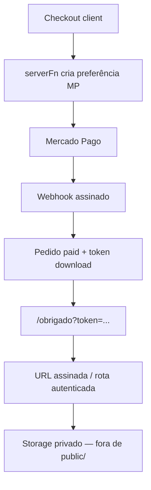

# Gate de entrega de PDFs (pós-pagamento)

## Problema atual

Os entregáveis (`public/*.pdf`) são URLs públicas. A rota `/obrigado` libera downloads sem prova de pagamento. Isso é aceitável só enquanto o Mercado Pago for stub; em produção com gateway real, qualquer pessoa pode acessar os arquivos.

## Objetivo

Liberar PDFs **somente** após confirmação de pagamento, com links de curta duração.

## Desenho recomendado

### Passos

1. **Mover PDFs** de `public/` para storage privado (R2/S3) ou pasta não servida estaticamente.
2. **Criar preferência** em `createServerFn` com `amount` recalculado via `planTotal(plan, bumpIds)` — nunca confiar no client.
3. **Webhook Mercado Pago**: validar assinatura do provedor (não CSRF); marcar pedido como pago; gerar token opaco (UUID) com TTL (ex.: 24–72h) ligado ao pedido.
4. **`/obrigado`**: exigir `token` válido; listar só os arquivos do pedido; links via URL assinada ou `serverFn`/rota que checa o token antes de streamear o PDF.
5. **CSRF**: manter `createCsrfMiddleware` em `src/start.ts` para as `serverFn` de criação de preferência; webhook usa assinatura MP.
6. **Pixel Purchase**: disparar com `value` do pedido confirmado (server ou token), não com query string.

### Fora deste plano (fase seguinte)

- Rate limit no endpoint de download
- CAPI Meta server-side
- HSTS no domínio/CDN
